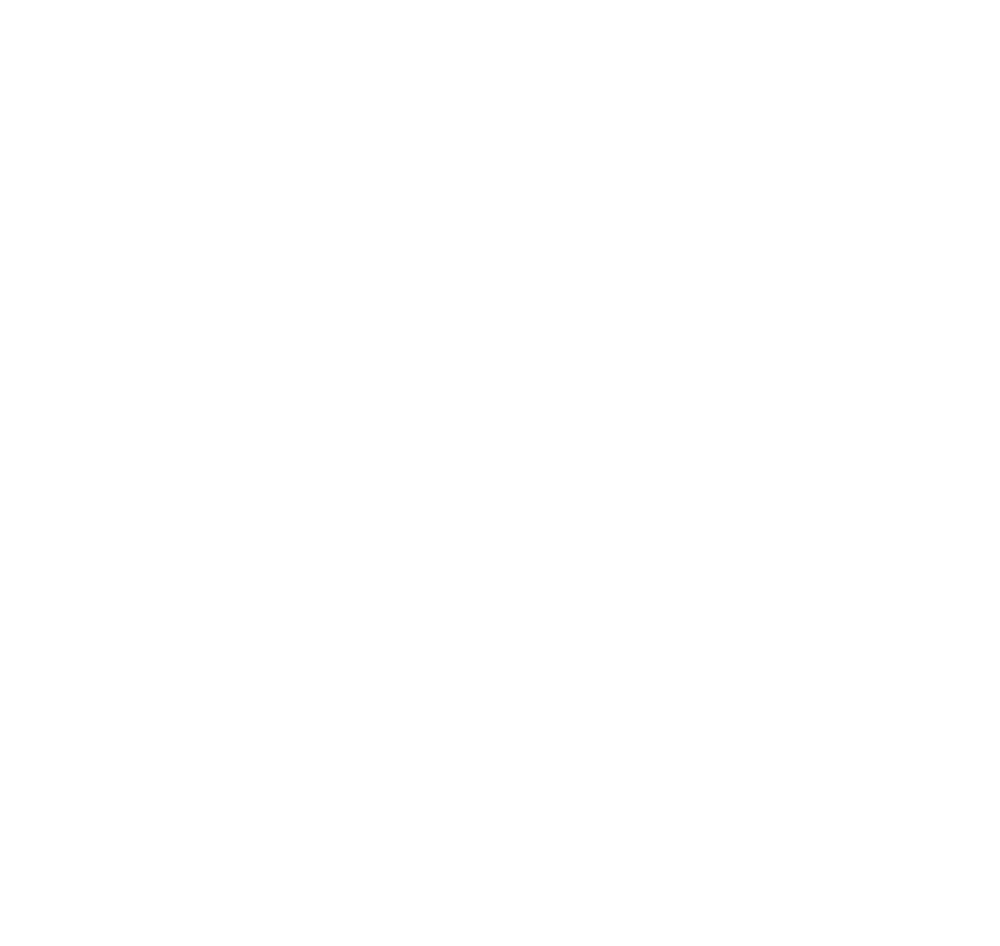

# LEAP Systems Dev Configuration

Modified: 2021-06

Source control for all development tooling and templating

## Python
 - Static Typing: `pyright`
 - Linting: `flake8`
 - Formatting: `autopep8`
 - Documentation: `sphinx`

## CPP
 - Linting: `cpplint`
 - Documentation: `Doxygen`
